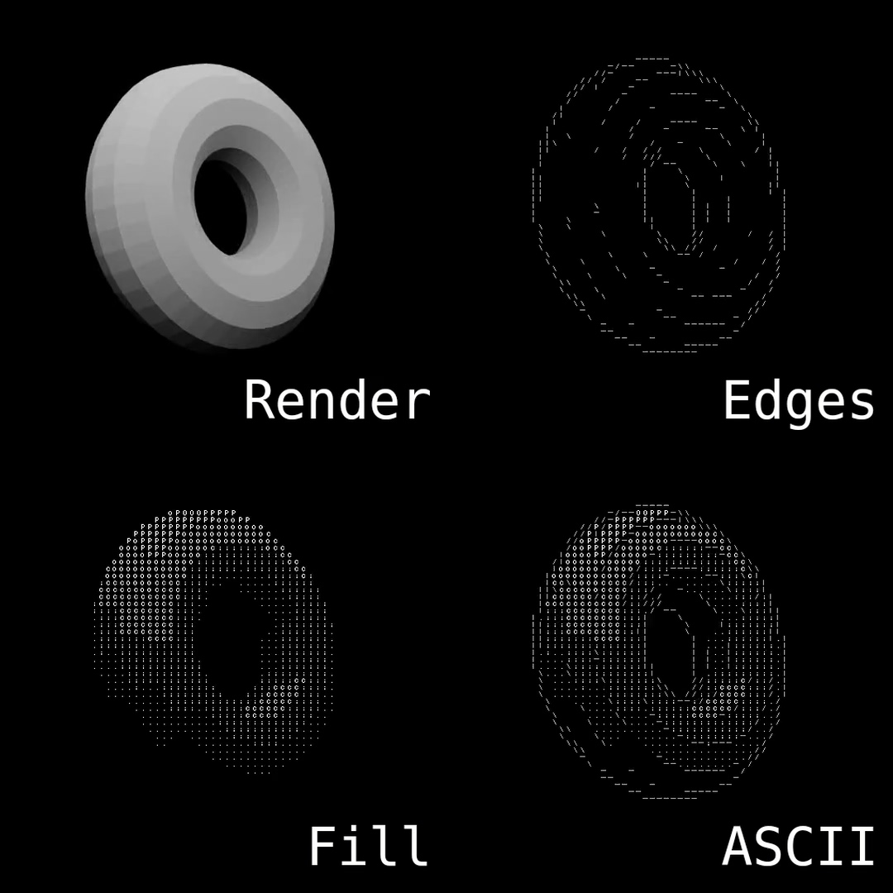
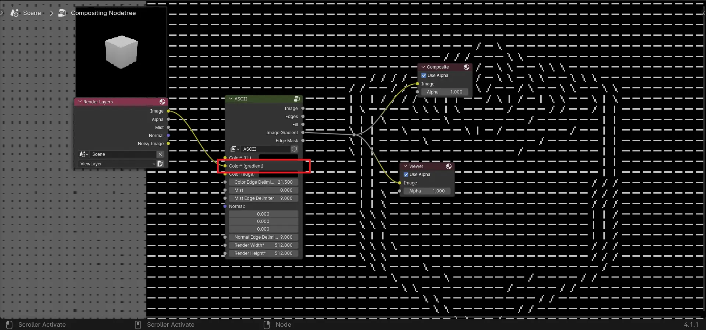
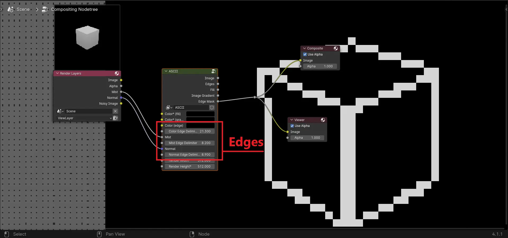
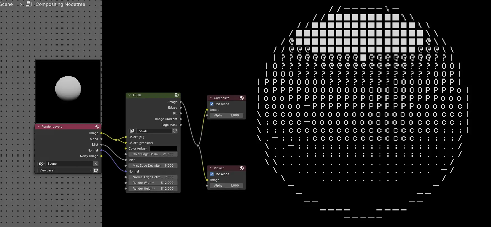

# ASCII Art Compositor Node Setup in Blender

This repository contains a Blender `.blend` file with a compositor node setup that converts images to ASCII art. The node setup is versatile and can be adjusted for different resolutions (in powers of 2 i.e. 128, 256, 512 etc.) and output styles.

***[DOWNLOAD](https://github.com/areebuzair/Blender-Image-To-ASCII/raw/refs/heads/main/Image_To_ASCII_Compositor.blend)***

## Features

- Converts any input image into ASCII art.
- Contains edge detection and (almost) proper edge flow.
- Works directly in Blender's compositor, no external software, script or addon needed.
- Easily adjustable node parameters to fine-tune the ASCII output.

## Getting Started

### Prerequisites

- Blender 3.x or higher installed on your machine.
- Basic knowledge of Blender's node system (helpful but not mandatory).

### How to Use

1. Clone the repository:
    ```bash
    git clone https://github.com/areebuzair/Blender-Image-To-ASCII.git
    ```
    Or, download the `Image_To_ASCII_Compositor.blend` file directly from [here](https://github.com/areebuzair/Blender-Image-To-ASCII/blob/main/Image_To_ASCII_Compositor.blend).
2. Open the `Image_To_ASCII_Compositor` file in Blender.
    Or, from any other Blender project, append the `ASCII` node group from the downloaded file.
3. In the **Compositing** workspace, ensure that **Use Nodes** is enabled. Add the `ASCII` node group by pressing `Shift A`  >`Group` > `ASCII`.
4. Load an image of your choice as input by adding an **Image** node or using the **Render Layers** node for your rendered scenes.
5. Adjust the ASCII pattern and resolution by tweaking the values in the node setup.
6. Render the output, and you'll get the ASCII art image in the render result.

## Node Group Inputs and Outputs

This ASCII node group features several input and output sockets that allow users to customize the ASCII art rendering. Below is a detailed explanation of each:

### Inputs

- **Color* (fill)**: This input takes an image, and its luminosity is used to create the fill portion of the ASCII art. The tonal variations in the image determine the density of the ASCII characters.
  

- **Color* (gradient)**: Accepts an image input to generate the ASCII art's gradient elements, such as slashes, dashes, and vertical bars. Using a mist pass is recommended for optimal results, though any image can work. This gradient is used to render the edges.
  

- **Color (edge)**: This input uses the provided image to compute the edges by analyzing the differences between Gaussian blurs, resulting in clean edge detection.

- **Color Edge Delimiter**: Controls the extent to which edges are included in the ASCII art.

- **Mist**: This input utilizes a mist pass or alpha mask to compute edges via Gaussian differences. It is particularly useful for blending depth-based edge effects.

- **Mist Edge Delimiter**: Similar to the color edge delimiter, this setting adjusts the prominence of mist-based edges. 

- **Normal**: Provides an input for a normal map, which is used to compute edges based on the differences in surface normals. This is ideal for capturing subtle geometry-based details.

- **Normal Edge Delimiter**: Defines the influence of the normal map on edge detection.
  

- **Render Width***: Sets the horizontal resolution of the ASCII image. This value must be a power of two to ensure proper scaling and rendering. It must match the render resolution width.

- **Render Height***: Determines the vertical resolution of the ASCII image. Similar to the width, this value also needs to be a power of two.It must match the render resolution height.


### Outputs

- **Image**: This output provides the final ASCII-rendered image, ready for use or further compositing.

- **Edges**: Outputs the edges of the input image, computed using gradient detection and edge-finding algorithms.

- **Fill**: Produces the fill portion of the ASCII art, which defines the main body of the rendered image.

- **Image Gradient**: This output provides the image gradient, which can be useful for custom edge detection workflows or advanced effects.

- **Edge Mask**: A mask highlighting the detected edges in the image, useful for isolating edge details for further processing, or for combining multiple ASCII arts.


## Example Outputs



## Frequently Faced Problems

### 1. Render is Blank or Incomplete
- **Description**: Sometimes the output render appears blank or only partially completed.
- **Solution**: Ensure that the input image is properly connected to the node setup. Verify that the image format is supported (e.g., PNG, JPEG) and that the resolution is appropriate for ASCII conversion.

---

### 2. ASCII Art is Too Dark or Bright
- **Description**: The ASCII art may appear darker or brighter than wanted.
- **Solution**: Use a `Brightness/Contrast` node to fine-tune the input fill image.

---

### 3. Broken ASCII Characters
- **Description**: The characters in the ASCII Output are broken/squashed.
- **Solution**: Make sure the render width and height are in powers of 2, and also that the node inputs match the actual render size.

| Problem Example | Solution Example |
| --------------- | ---------------- |
|  |  |

---

### 4. Half the Image is rendered as ASCII
- **Description**: The bottom half or so of the image is completely flooded with ASCII characters despite the input image not having anything there.
- **Solution**: Your device has most likely overheated. Let it cool down for a while.

---

### 5. The Edges are too Prominent
- **Description**: The egdes bleed into the main image.
- **Solution**: Adjust the edge delimiters.
  

---

### 6. Transparent Final Render
- **Description**: The final render is transparent.
- **Solution**: Make sure [fillASCII.png](fillASCII.png) and [edgesASCII.jpg](edgesASCII.jpg) are next to the `Image_To_ASCII_Compositor.blend` file.

## Contributing

If you'd like to contribute or improve the node setup, feel free to fork the repository and submit a pull request. Contributions are always welcome!

## License

This project is licensed under the MIT License - see the [LICENSE](LICENSE) file for details. Blender itself is released under the GNU General Public License (GPL, or “free software”).

---

## Acknowledgments

- Blender Community for ongoing support and resources.
- ASCII Art inspiration and technique from [Acerola](https://youtu.be/gg40RWiaHRY?feature=shared).

---
